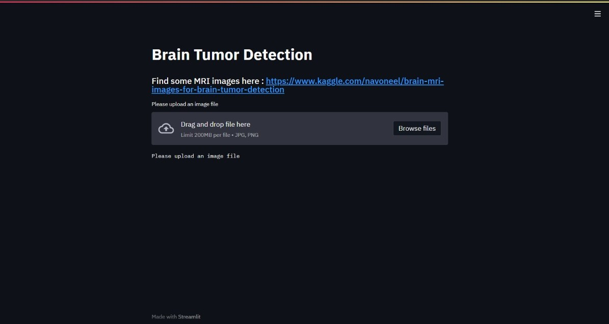
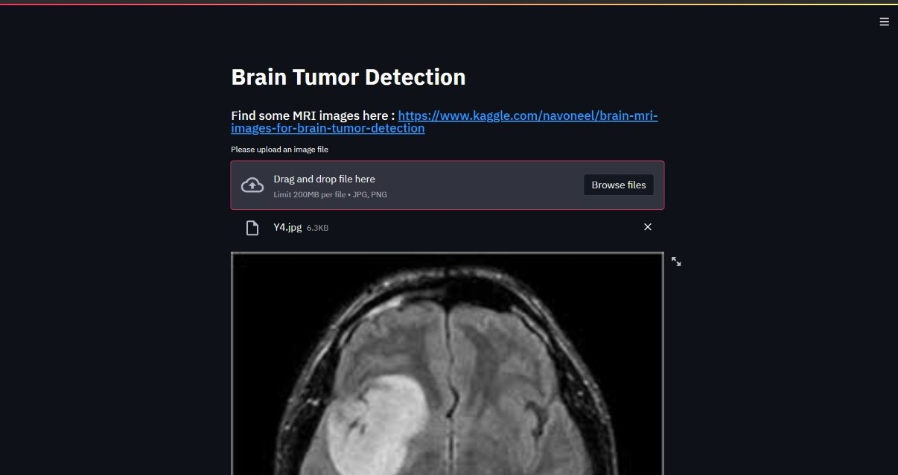
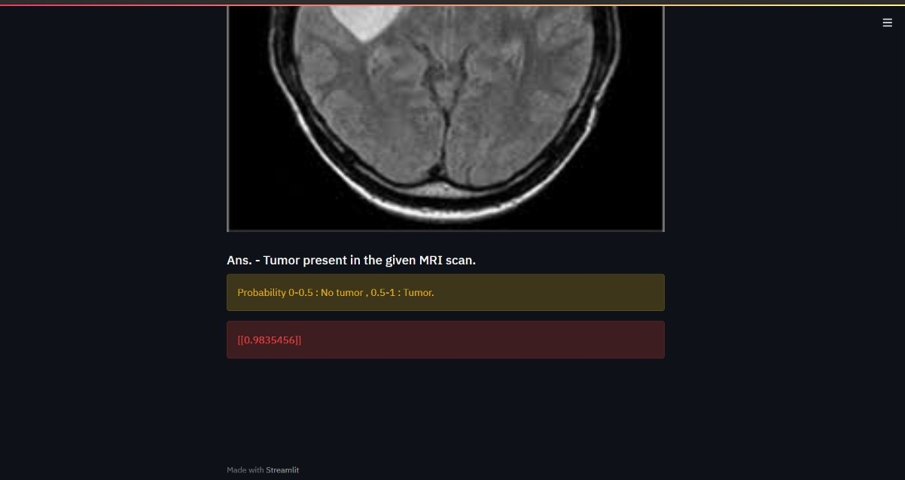

# Brain-Tumor-Classification-Streamlit

Brain tumor detection using transfer learning (VGG16)
Dataset is large to upload on github.
So, link is provided below :
Link for dataset - https://www.kaggle.com/navoneel/brain-mri-images-for-brain-tumor-detection

Streamlit app :

